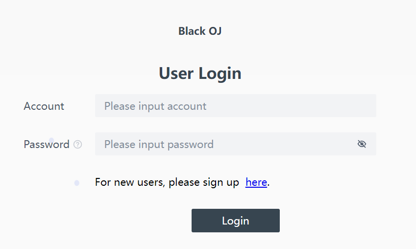
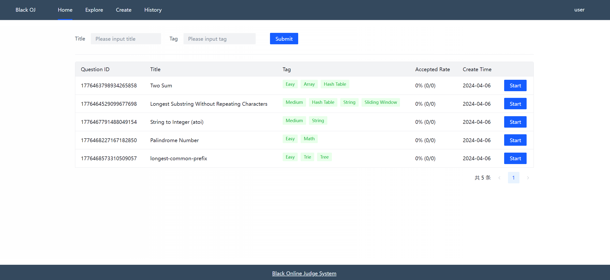
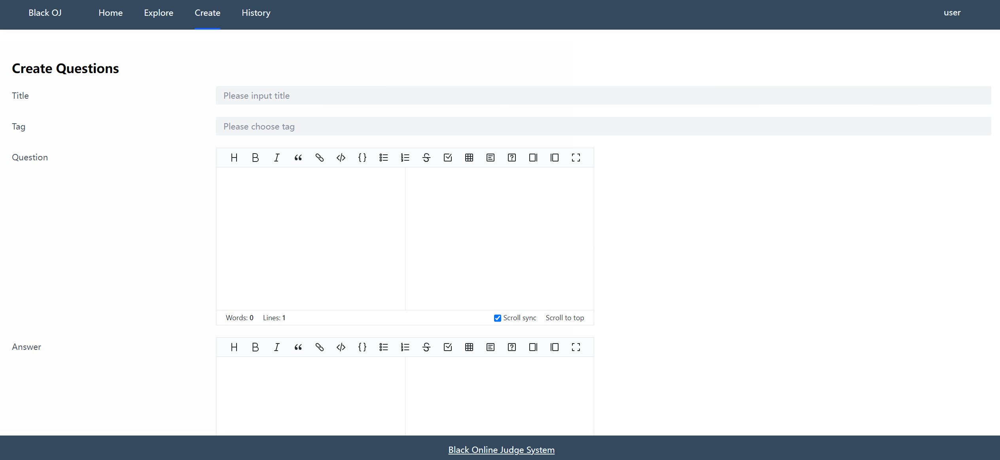
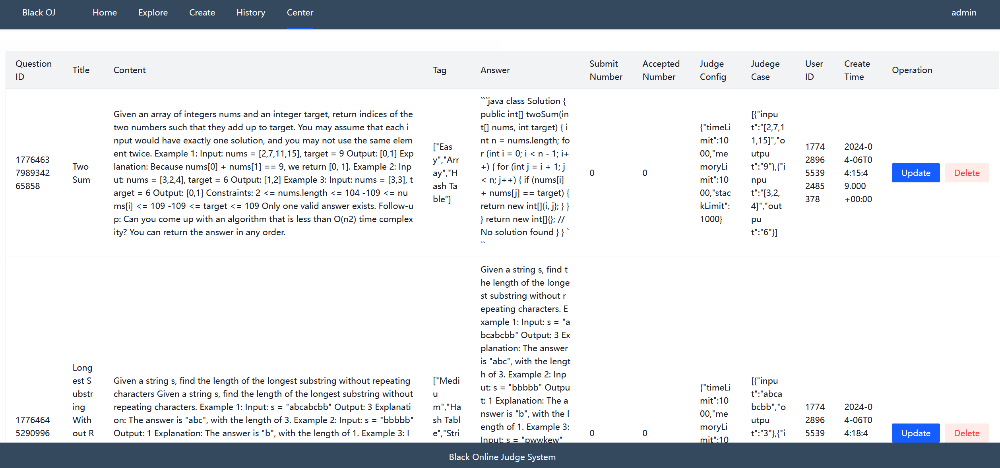
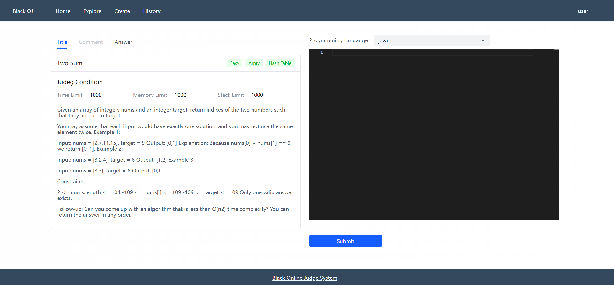

# oj-frontend

## Overview

The frontend part of OJ project. In the system frontend, admin can create and manage questions, while users can freely search for questions, read them, and do online coding and submit code.

## Screenshots






## Features

User Management:

- User registration, login.
- User permission management

Problem Management:

- Problem bank management, including adding, editing, and deleting problems.
- Problem classification and tagging to facilitate users to search for problems according to different criteria.

Code Evaluation:

- Submit code for evaluation, supporting multiple programming languages such as C/C++, Java, Python, etc.
- Real-time feedback on evaluation results, including pass, error, timeout, and other statuses.

## Technology

- [Vue3](https://cn.vuejs.org/guide/introduction.html)
- [TypeScript](https://www.typescriptlang.org/zh/docs/)
- [Vue-Cli](https://cli.vuejs.org/zh/guide/)
- [Arco Design ](https://arco.design/vue/docs/start)
- [Vuex](https://vuex.vuejs.org/)
- ESlint
- Prettier
- Markdown 
- Monaco Editor
- OpenAPI Request

## Projection Structure

```
- src
 - access: control user access, here we have admin and user
 - assets: pictures
 - components: page componnet
 - layouts: config page layout
 - plugins: config axios
 - router: control route
 - store: use vuex to store share data
 - views: page
```

## Project setup

### Start Backend

Make sure backend project run successfully

### Setup

```
npm install
```

### Compiles and hot-reloads for development

```
npm run serve
```

### Compiles and minifies for production

```
npm run build
```

### Lints and fixes files

```
npm run lint
```

### Customize configuration

See [Configuration Reference](https://cli.vuejs.org/config/).
